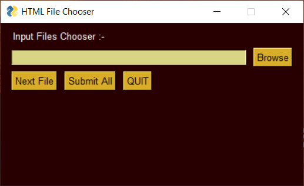
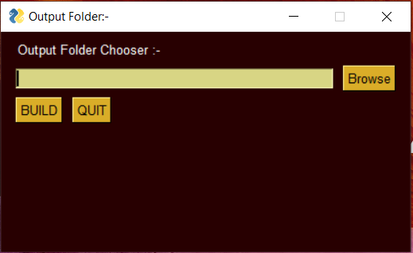
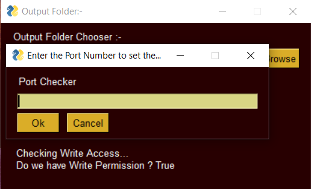
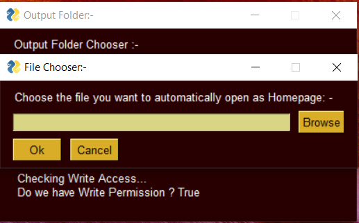
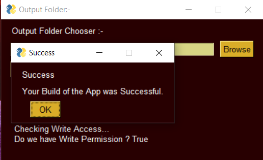

# PyramidBuilder
Make an pyramid app only by using HTML, CSS &amp; Javascript. This automatically creates code and configures the file.

As wrote above, anyone can easily develop an app using HTML, CSS and Javascript knowledge. You can use CSS, and Javascript if you want, else neglect them, pure html can also be used to develop an pyramid app, or more precisely a webapp.

- #### And make sure you have python installed on your device.

------------

# Installing needed Modules :-
Before going to use the PyramidBuilder, you need to install some modules.
- Go to the Command Line:-  
>On Windows :-  
>  
>Press the Start Menu Button.  
>Search by typing cmd.  
>Click on the app named Command Prompt


- Use the pip command :-
>On Windows :-  
>  
>Type the following command :-  
>```cmd
>pip install PySimpleGUI BeautifulSoup4
>```

##### Some code will be executed there.
##### This is all you need for executing PyramidBuilder.

------------

# Configuration that You Need to Do :-
  
In HTML files, **Images should be in Base64 format**(textual),  
For example, if you have an image link, i.e. `` then it should be changed as, ``, you can get it converted through many websites such as  CodeBeautify on `https://codebeautify.org/image-to-base64-converter`.
There you can get the Base64 code, complete `` tag with everything done is also provided.
Now handling large Base64 Code can be done using Notepad. Since its smoother while handling such large code.

That's enough.

#### NOTE : Don't create hyperlinks on text to other websites like `<A href='https://www.abc.com' > Some Text </A>`, else you an use them as text. By simply writing http://www.abc.com/ in between the text. 
#### As : `You can go to link : http://www.abc.com/`

------------

# Steps to create an App :-
Simply, prepare HTML files using inline CSS and <script> tag for Javascript on the same HTML file. Multiple files can be used but individual CSS and Javascript for them should be in the same file in which you have HTML.

- #### You have to download the PyramidBuilder.py file from this repository. Though repository may be a big word, simply download the file from the main branch.(above 👆)
- #### Then,  the only think you to do is to double-click on it and further the program is self explanatory. It's a GUI based program, so you  don't have to worry about learning to code.

# A Tutorial:
#### On the Starting screen you will see :-
<p align="center">
  <br>  
  Starting Screen.
</p>

- Click on Browse Button.
- Choose a File.
- Click Next File.
- Browse Another File.
##### When You are done choosing all the files press Submit All button.


Next, You will see a screen like :-
<p align="center">
  <br>  
  Folder Choosing Screen.
</p>

- Click on Browse Button.
- Choose a Folder where you want the Program to create the Pyramid App File (The Output).
- Then, Click BUILD button.
- It will ask you for a port number(You can enter a number between 8000 - 65000).

A screen like :-

Next, You will see a screen like :-
<p align="center">
  <br>  
  Port Number Screen.
</p>

Finally,
 - It will ask for a Homepage file, a HTML file that automatically opens up as a starting screen.
 
 Next, You will see a screen like :-
<p align="center">
  <br>  
  Homepage Screen.
</p>
 - Choose a file by browsing.
 -  Press OK.
 

 Task is done now.

A screen will be showing :- 
<p align="center">
  <br>  
  Done Screen.
</p>
